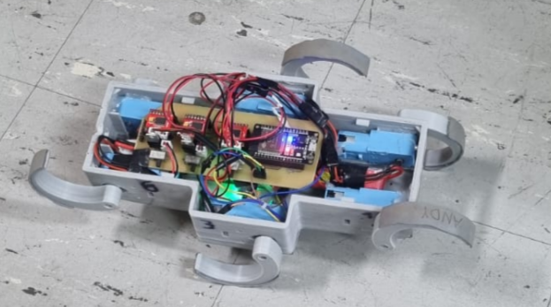

# RHex Robot Reinforcement Learning Implementation

Real-world implementation of DroQ algorithm for hexapod locomotion on custom RHex robot with ESP32 microcontroller.

## 📖 Project Overview
- **RL Agent**: DroQ algorithm (Stable Baselines3)
- **Hardware**: 6-DoF RHex with ESP32, TB6612 drivers, IMU, and IR binary sensor
- **State Space**: IMU data (orientation, angular velocity) + binary proximity
- **Action Space**: ΔVoltage for 6 motors
- **Training**: 30min on GTX1650 using proprioceptive feedback

## 🚀 Features
- Custom Gym environment with real-world physics constraints
- Low-latency UDP communication (20Hz update rate)
- Sensor-failure resilient architecture
- Energy-efficient gait learning

## Training

## Evaluation
